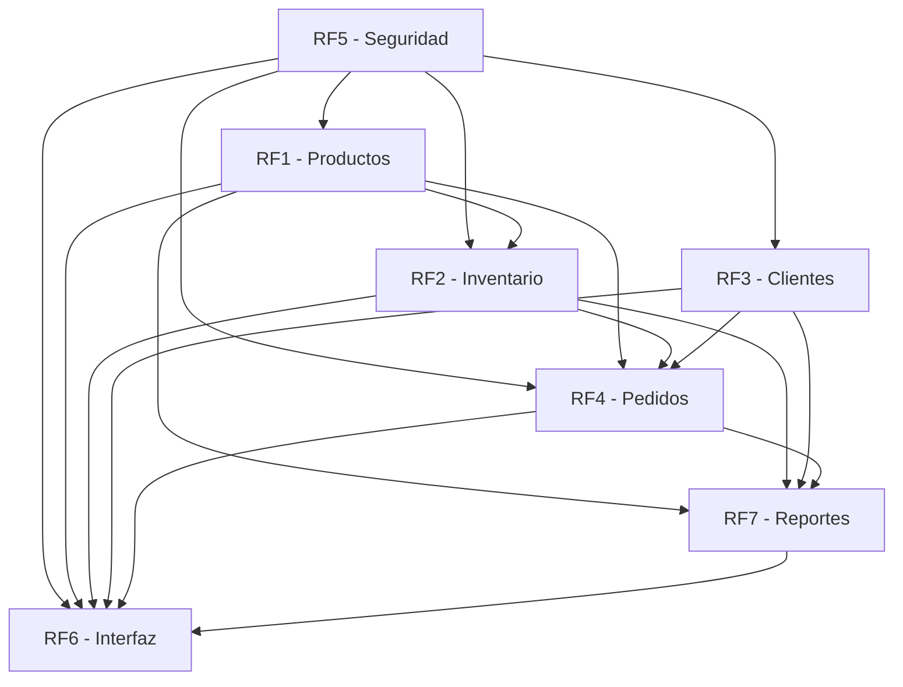

# Índice de Historias de Usuario - Sistema Milaccesorios

## Resumen del Proyecto

Este documento presenta el índice completo de todas las historias de usuario desarrolladas para el **Sistema de Gestión Integral de Milaccesorios**, organizadas por requerimientos funcionales según la especificación original.

Cada requerimiento incluye **historias de usuario detalladas** con criterios de aceptación, escenarios de prueba, **entradas, salidas y procedimientos técnicos** específicos para la implementación.

---

## Notas Técnicas Importantes

### 🔍 **Entradas, Salidas y Procedimientos**
Cada archivo de requerimiento ahora incluye:
- **Entradas:** Datos necesarios para ejecutar la funcionalidad
- **Salidas:** Resultados esperados y artefactos generados  
- **Procedimientos:** Pasos técnicos detallados para la implementación

### 🏗️ **Arquitectura del Sistema**
- **Backend:** .NET Core/C# con Entity Framework
- **Frontend:** Blazor Server/WebAssembly + Bootstrap 5
- **Base de datos:** SQLite con migraciones automáticas
- **Seguridad:** JWT tokens, bcrypt hashing, roles-based authorization

### 📊 **Consideraciones de Rendimiento**
- Índices optimizados para consultas frecuentes
- Cache inteligente para reportes y consultas
- Procesamiento asíncrono para tareas largas
- Optimización de imágenes y recursos estáticos

---

## Estructura de Historias de Usuario

### [RF1 - Gestión de Productos](RF1_Gestion_Productos.md)

**Estimación:** 21 puntos de historia (42 horas)

#### RF1.1: Registrar, editar y eliminar productos

- RF1.1.1 - Registrar Producto
- RF1.1.2 - Editar Producto  
- RF1.1.3 - Eliminar Producto

#### RF1.2: Gestionar categorías y materiales de productos

- RF1.2.1 - Gestionar Categorías
- RF1.2.2 - Gestionar Materiales

#### RF1.3: Cargar imágenes y descripciones detalladas

- RF1.3.1 - Gestionar Imágenes de Productos
- RF1.3.2 - Descripciones Detalladas

---

### [RF2 - Gestión de Inventario](RF2_Gestion_Inventario.md)

**Estimación:** 18 puntos de historia (36 horas)

#### RF2.1: Controlar el stock por producto

- RF2.1.1 - Visualizar Stock Actual
- RF2.1.2 - Ajustar Stock Manualmente
- RF2.1.3 - Registrar Entradas de Mercancía

#### RF2.2: Generar alertas de inventario bajo

- RF2.2.1 - Configurar Alertas de Stock Mínimo
- RF2.2.2 - Visualizar Panel de Alertas
- RF2.2.3 - Generar Reportes de Alertas

---

### [RF3 - Gestión de Clientes](RF3_Gestion_Clientes.md)

**Estimación:** 24 puntos de historia (48 horas)

#### RF3.1: Registrar clientes

- RF3.1.1 - Registrar Nuevo Cliente
- RF3.1.2 - Editar Información de Cliente
- RF3.1.3 - Desactivar Cliente

#### RF3.2: Consultar historial de compras por cliente

- RF3.2.1 - Visualizar Historial Completo
- RF3.2.2 - Generar Reportes de Cliente
- RF3.2.3 - Identificar Patrones de Compra

#### RF3.3: Gestionar comunicaciones con clientes (Adicional)

- RF3.3.1 - Gestionar Comunicaciones con Clientes

---

### [RF4 - Gestión de Pedidos](RF4_Gestion_Pedidos.md)

**Estimación:** 32 puntos de historia (64 horas)

#### RF4.1: Crear y hacer seguimiento de pedidos

- RF4.1.1 - Crear Nuevo Pedido
- RF4.1.2 - Modificar Pedido Existente
- RF4.1.3 - Hacer Seguimiento de Pedidos

#### RF4.2: Actualizar estado del pedido

- RF4.2.1 - Gestionar Estados de Pedido
- RF4.2.2 - Estado Pendiente
- RF4.2.3 - Estado En Producción
- RF4.2.4 - Estado Enviado
- RF4.2.5 - Estado Entregado

#### RF4.3: Cancelar pedidos (Adicional)

- RF4.3.1 - Cancelar Pedidos

---

### [RF5 - Seguridad y Acceso](RF5_Seguridad_Acceso.md)

**Estimación:** 32 puntos de historia (64 horas)

#### RF5.1: Autenticación de usuarios

- RF5.1.1 - Inicio de Sesión
- RF5.1.2 - Gestión de Contraseñas
- RF5.1.3 - Gestión de Sesiones

#### RF5.2: Gestión de roles (Administrador, Vendedor)

- RF5.2.1 - Definir Roles y Permisos
- RF5.2.2 - Asignar Roles a Usuarios
- RF5.2.3 - Control de Acceso Basado en Roles

#### RF5.3: Auditoría y registros (Adicional)

- RF5.3.1 - Auditoría y Registros

#### RF5.4: Configuración de seguridad (Adicional)

- RF5.4.1 - Configuración de Seguridad

---

### [RF6 - Interfaz de Usuario](RF6_Interfaz_Usuario.md)

**Estimación:** 28 puntos de historia (56 horas)

#### RF6.1: Interfaz web responsive y panel administrativo

- RF6.1.1 - Diseño Responsive
- RF6.1.2 - Panel de Control Principal
- RF6.1.3 - Navegación y Menús
- RF6.1.4 - Formularios y Validaciones
- RF6.1.5 - Tablas y Listados
- RF6.1.6 - Notificaciones y Mensajes

#### RF6.2: Rendimiento y usabilidad (Adicional)

- RF6.2.1 - Rendimiento y Usabilidad

---

### [RF7 - Reportes](RF7_Reportes.md)

**Estimación:** 39 puntos de historia (78 horas)

#### RF7.1: Generar reportes de ventas, inventario y pedidos por cliente

- RF7.1.1 - Reportes de Ventas
- RF7.1.2 - Reportes de Inventario
- RF7.1.3 - Reportes de Pedidos por Cliente

#### RF7.2: Dashboard de reportes (Adicional)

- RF7.2.1 - Dashboard de Reportes

#### RF7.3: Reportes personalizados (Adicional)

- RF7.3.1 - Reportes Personalizados

#### RF7.4: Exportación y distribución (Adicional)

- RF7.4.1 - Exportación y Distribución

---

## Resumen de Estimaciones

| Requerimiento | Puntos de Historia | Horas Estimadas |
|---------------|-------------------|-----------------|
| RF1 - Gestión de Productos | 21 | 42 |
| RF2 - Gestión de Inventario | 18 | 36 |
| RF3 - Gestión de Clientes | 24 | 48 |
| RF4 - Gestión de Pedidos | 32 | 64 |
| RF5 - Seguridad y Acceso | 32 | 64 |
| RF6 - Interfaz de Usuario | 28 | 56 |
| RF7 - Reportes | 39 | 78 |
| **TOTAL** | **194** | **388** |

---

## Cronograma Sugerido por Sprints

### Sprint 1 (Semanas 1-2): Fundación

- **RF5 - Seguridad y Acceso** (32 pts)
- **RF1 - Gestión de Productos** (21 pts)
- **Total:** 53 puntos

### Sprint 2 (Semanas 3-4): Operaciones Core

- **RF2 - Gestión de Inventario** (18 pts)
- **RF3 - Gestión de Clientes** (24 pts)
- **Total:** 42 puntos

### Sprint 3 (Semanas 5-6): Proceso de Negocio

- **RF4 - Gestión de Pedidos** (32 pts)
- **Total:** 32 puntos

### Sprint 4 (Semanas 7-8): Interfaz y UX

- **RF6 - Interfaz de Usuario** (28 pts)
- **Total:** 28 puntos

### Sprint 5 (Semanas 9-10): Análisis y Reportes

- **RF7 - Reportes** (39 pts)
- **Total:** 39 puntos

---

## Dependencias entre Módulos

---

## Criterios de Aceptación Generales

Cada historia de usuario incluye:

✅ **Criterios de Aceptación específicos** con condiciones medibles  
✅ **Escenarios de Prueba** detallados para validación  
✅ **Definición de Terminado** (Definition of Done)  
✅ **Estimación de esfuerzo** en puntos de historia y horas  
✅ **Dependencias** identificadas con otros requerimientos  

---

## Notas de Implementación

1. **Tecnologías:** .NET Core/C#, Blazor/Bootstrap, SQLite
2. **Metodología:** Scrum con sprints de 2 semanas
3. **Pruebas:** Unitarias (80% cobertura mínima), integración, funcionales
4. **Documentación:** Técnica y de usuario para cada módulo
5. **Despliegue:** Entorno de producción simulado

---

## Contacto y Seguimiento

- **Líder del Proyecto:** [Definir]
- **Product Owner:** [Definir]  
- **Scrum Master:** [Definir]
- **Equipo de Desarrollo:** [Definir]

**Última actualización:** Agosto 2025
